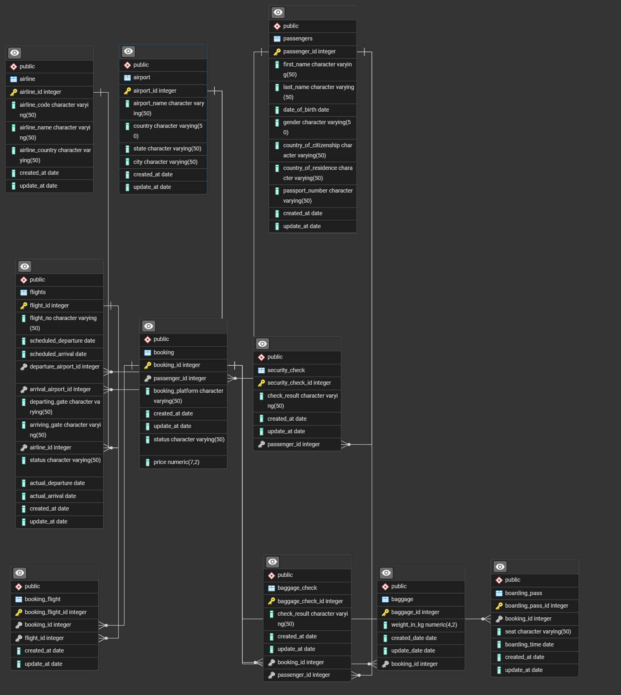

# AeroInsight Analytics — International Airport Analytics

**Company:** AeroInsight Analytics

---

## Project overview

AeroInsight Analytics is a small analytics team embedded with a fictional international airport operator. This repository contains a relational dataset and analytical queries that explore passenger behavior, flight performance, baggage statistics, security outcomes, and airline/airport-level revenue. The goal is to practice joins, aggregations, time-series trends, and basic KPIs useful for airport operations and business intelligence.

Core analytics types: operational (on-time performance, security fails), commercial (revenue per airline, average ticket price), customer (baggage weight per passenger, passenger counts by country), and infrastructure (busiest airports/gates).

---

## Schema (high level)

The database is `international_airport` (Postgres). Key tables:

* `airline` — airline master data
* `airport` — airports (name, city, country)
* `flights` — flights with departure/arrival airport IDs and airline
* `booking` — bookings (price, platform, passenger_id)
* `booking_flight` — mapping bookings to flights (N-to-N)
* `passengers` — passenger demographics
* `boarding_pass` — boarding pass records (seat, boarding_time)
* `baggage` — baggage records (weight, booking_id)
* `baggage_check` — baggage security checks
* `security_check` — passenger security checks

Primary keys and foreign keys were created (see `schema.sql` / `dump.sql`).

---

## Analytical topics & SQL

These queries are included in `queries.sql`. Run them to reproduce the analytics. They illustrate joins, aggregations, filtering and date-truncation.

### 1) Number of passengers per country of citizenship

```sql
SELECT country_of_citizenship, COUNT(*) AS total_passengers
FROM passengers
GROUP BY country_of_citizenship
ORDER BY total_passengers DESC;
```

### 2) Top 5 busiest airports by number of departing flights

```sql
SELECT a.airport_name, COUNT(f.flight_id) AS total_departures
FROM flights f
JOIN airport a ON f.departure_airport_id = a.airport_id
GROUP BY a.airport_name
ORDER BY total_departures DESC
LIMIT 5;
```

### 3) Average baggage weight per passenger

```sql
SELECT p.passenger_id, p.first_name, p.last_name, AVG(b.weight_in_kg) AS avg_baggage_weight
FROM passengers p
JOIN booking bk ON p.passenger_id = bk.passenger_id
JOIN baggage b ON bk.booking_id = b.booking_id
GROUP BY p.passenger_id, p.first_name, p.last_name
ORDER BY avg_baggage_weight DESC;
```

### 4) Number of bookings per booking platform

```sql
SELECT booking_platform, COUNT(*) AS total_bookings
FROM booking
GROUP BY booking_platform
ORDER BY total_bookings DESC;
```

### 5) On-time vs delayed flights (departure)

```sql
SELECT
    CASE
        WHEN actual_departure <= scheduled_departure THEN 'On Time'
        ELSE 'Delayed'
    END AS departure_status,
    COUNT(*) AS total_flights
FROM flights
GROUP BY departure_status;
```

### 6) Average ticket price by booking platform

```sql
SELECT booking_platform, AVG(price) AS avg_ticket_price
FROM booking
GROUP BY booking_platform
ORDER BY avg_ticket_price DESC;
```

### 7) Top 5 airlines by number of flights

```sql
SELECT al.airline_name, COUNT(f.flight_id) AS total_flights
FROM flights f
JOIN airline al ON f.airline_id = al.airline_id
GROUP BY al.airline_name
ORDER BY total_flights DESC
LIMIT 5;
```

### 8) Passengers who failed security checks

```sql
SELECT p.passenger_id, p.first_name, p.last_name, sc.check_result
FROM passengers p
JOIN security_check sc ON p.passenger_id = sc.passenger_id
WHERE sc.check_result = 'Failed';
```

### 9) Revenue generated per airline

```sql
SELECT al.airline_name, SUM(bk.price) AS total_revenue
FROM booking bk
JOIN booking_flight bf ON bk.booking_id = bf.booking_id
JOIN flights f ON bf.flight_id = f.flight_id
JOIN airline al ON f.airline_id = al.airline_id
GROUP BY al.airline_name
ORDER BY total_revenue DESC;
```

### 10) Monthly passenger booking trends

```sql
SELECT DATE_TRUNC('month', created_at) AS month, COUNT(*) AS total_bookings
FROM booking
GROUP BY month
ORDER BY month;
```

## How to run (local development)

**Prerequisites**: PostgreSQL installed and running, Python 3.8+, git.

1. Clone the repo:

```bash
git clone https://github.com/<your-username>/AeroInsight-Airport-Analytics.git
cd AeroInsight-Airport-Analytics
```

2. Create the Postgres database and import schema/data (adjust user/paths):

```bash
createdb international_airport
psql -U <db_user> -d international_airport -f schema.sql
# or if you have a full dump with data:
psql -U <db_user> -d international_airport -f dump.sql
```

3. Configure DB credentials: set environment variables or create a `config.py` / `.env` file. Example environment variables:

```bash
export DB_HOST=localhost
export DB_NAME=international_airport
export DB_USER=your_db_user
export DB_PASSWORD=your_password
export DB_PORT=5432
```

(Windows PowerShell: `$env:DB_PASSWORD = "your_password"`)

4. Run the query runner (example):

```bash
python main.py
# or a dedicated runner that formats SELECT results
python run_queries.py
```
---

## ER Diagram



---


